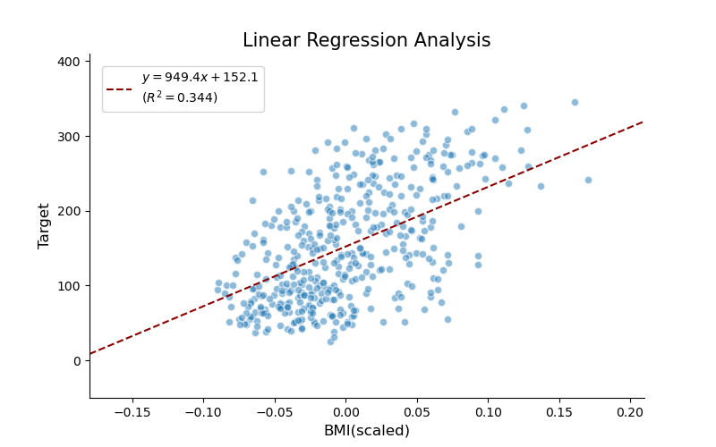
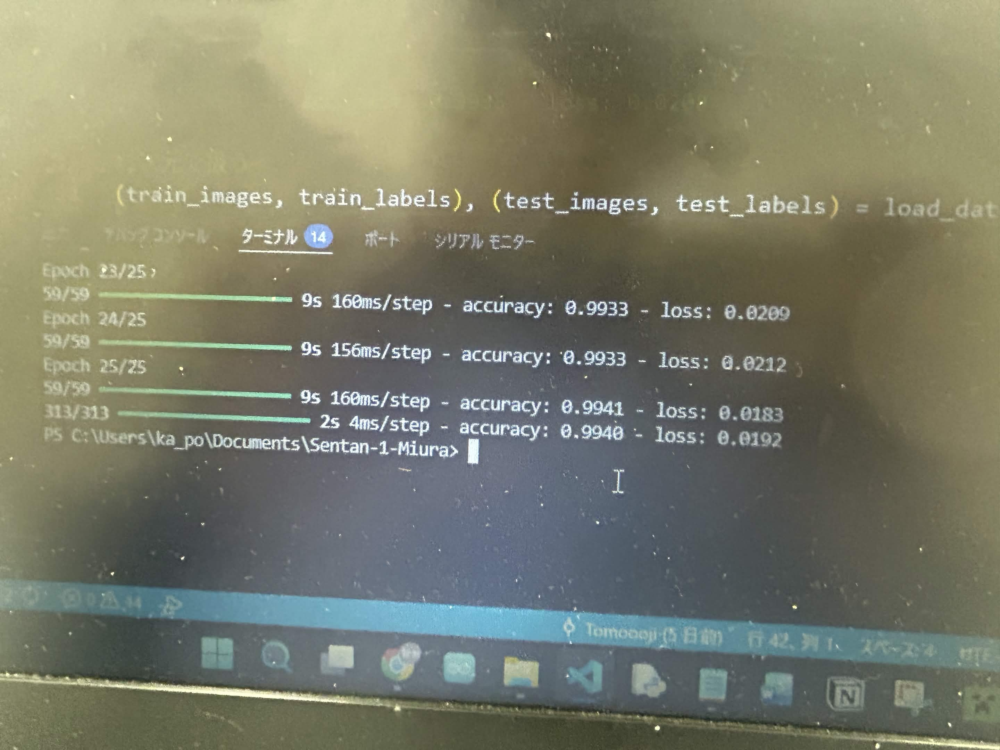

# Sentan-1-Miura

先端生命科学実験の三浦先生回分のプログラムフォルダ

## 環境構築メモ

python のバージョン: 3.10.9
Anacondaとvenvは併用できないぽいのでなーし！！

```
conda create -n tf_env python=3.10 // 仮想環境(tf_env)の作成
conda activate tf_env // 仮想環境の有効化←Anaconda promptでやった方が良いかも
conda env list // 環境一覧(*ついてるのが現在地)

code // Anaconda promptからVSCodeに移動

conda list // condaに入ってるものリスト
conda list [パッケージ] // パッケージの情報取得(なかったらwarning)

conda install -c conda-forge tensorflow
```

## 内容関連－1日目

データについて(from https://qiita.com/kotaroito/items/9e02e7378fc0053c01c0)

> 糖尿病患者442名のデータが入っており、基礎項目（age, sex, body mass index, average blood pressure）と6つの血液検査項目を入力とし、1年後の進行状況を予測ターゲットにします。




## 内容関連-2日目

```
Epoch 1/3
59/59 ━━━━━━━━━━━━━━━━━━━━ 1s 5ms/step - accuracy: 0.8292 - loss: 0.6771 
Epoch 2/3
59/59 ━━━━━━━━━━━━━━━━━━━━ 0s 5ms/step - accuracy: 0.9135 - loss: 0.3105 
Epoch 3/3
59/59 ━━━━━━━━━━━━━━━━━━━━ 0s 5ms/step - accuracy: 0.9323 - loss: 0.2442 
313/313 ━━━━━━━━━━━━━━━━━━━━ 1s 2ms/step - accuracy: 0.9406 - loss: 0.2155 
```





---

### Test-1

```
Epoch 1/25
59/59 ━━━━━━━━━━━━━━━━━━━━ 12s 149ms/step - accuracy: 0.7280 - loss: 0.8808
Epoch 2/25
59/59 ━━━━━━━━━━━━━━━━━━━━ 10s 174ms/step - accuracy: 0.9427 - loss: 0.1874
Epoch 3/25
59/59 ━━━━━━━━━━━━━━━━━━━━ 10s 176ms/step - accuracy: 0.9634 - loss: 0.1216
Epoch 4/25
59/59 ━━━━━━━━━━━━━━━━━━━━ 10s 171ms/step - accuracy: 0.9731 - loss: 0.0909
Epoch 5/25
59/59 ━━━━━━━━━━━━━━━━━━━━ 9s 156ms/step - accuracy: 0.9768 - loss: 0.0760 
Epoch 6/25
59/59 ━━━━━━━━━━━━━━━━━━━━ 9s 158ms/step - accuracy: 0.9797 - loss: 0.0667 
Epoch 7/25
59/59 ━━━━━━━━━━━━━━━━━━━━ 10s 161ms/step - accuracy: 0.9826 - loss: 0.0580
Epoch 8/25
59/59 ━━━━━━━━━━━━━━━━━━━━ 9s 157ms/step - accuracy: 0.9850 - loss: 0.0516 
Epoch 9/25
59/59 ━━━━━━━━━━━━━━━━━━━━ 9s 160ms/step - accuracy: 0.9863 - loss: 0.0476 
Epoch 10/25
59/59 ━━━━━━━━━━━━━━━━━━━━ 9s 154ms/step - accuracy: 0.9873 - loss: 0.0417 
Epoch 11/25
59/59 ━━━━━━━━━━━━━━━━━━━━ 10s 172ms/step - accuracy: 0.9878 - loss: 0.0397
Epoch 12/25
59/59 ━━━━━━━━━━━━━━━━━━━━ 11s 186ms/step - accuracy: 0.9888 - loss: 0.0364
Epoch 13/25
59/59 ━━━━━━━━━━━━━━━━━━━━ 9s 159ms/step - accuracy: 0.9896 - loss: 0.0340 
Epoch 14/25
59/59 ━━━━━━━━━━━━━━━━━━━━ 9s 157ms/step - accuracy: 0.9891 - loss: 0.0344 
Epoch 15/25
59/59 ━━━━━━━━━━━━━━━━━━━━ 9s 155ms/step - accuracy: 0.9909 - loss: 0.0301 
Epoch 16/25
59/59 ━━━━━━━━━━━━━━━━━━━━ 9s 157ms/step - accuracy: 0.9914 - loss: 0.0279 
Epoch 17/25
59/59 ━━━━━━━━━━━━━━━━━━━━ 10s 160ms/step - accuracy: 0.9917 - loss: 0.0268
Epoch 18/25
59/59 ━━━━━━━━━━━━━━━━━━━━ 9s 159ms/step - accuracy: 0.9921 - loss: 0.0258 
Epoch 19/25
59/59 ━━━━━━━━━━━━━━━━━━━━ 11s 177ms/step - accuracy: 0.9927 - loss: 0.0239
Epoch 20/25
59/59 ━━━━━━━━━━━━━━━━━━━━ 10s 166ms/step - accuracy: 0.9928 - loss: 0.0233
Epoch 21/25
59/59 ━━━━━━━━━━━━━━━━━━━━ 10s 177ms/step - accuracy: 0.9931 - loss: 0.0226
Epoch 22/25
59/59 ━━━━━━━━━━━━━━━━━━━━ 10s 169ms/step - accuracy: 0.9934 - loss: 0.0217
Epoch 23/25
59/59 ━━━━━━━━━━━━━━━━━━━━ 10s 163ms/step - accuracy: 0.9935 - loss: 0.0208
Epoch 24/25
59/59 ━━━━━━━━━━━━━━━━━━━━ 10s 173ms/step - accuracy: 0.9938 - loss: 0.0190
Epoch 25/25
59/59 ━━━━━━━━━━━━━━━━━━━━ 10s 163ms/step - accuracy: 0.9940 - loss: 0.0190
313/313 ━━━━━━━━━━━━━━━━━━━━ 2s 5ms/step - accuracy: 0.9935 - loss: 0.0205
```

### Test-2
```
Epoch 1/25
59/59 ━━━━━━━━━━━━━━━━━━━━ 13s 173ms/step - accuracy: 0.7173 - loss: 0.9178
Epoch 2/25
59/59 ━━━━━━━━━━━━━━━━━━━━ 10s 172ms/step - accuracy: 0.9345 - loss: 0.2155
Epoch 3/25
59/59 ━━━━━━━━━━━━━━━━━━━━ 11s 179ms/step - accuracy: 0.9604 - loss: 0.1325
Epoch 4/25
59/59 ━━━━━━━━━━━━━━━━━━━━ 9s 158ms/step - accuracy: 0.9686 - loss: 0.1017 
Epoch 5/25
59/59 ━━━━━━━━━━━━━━━━━━━━ 10s 161ms/step - accuracy: 0.9746 - loss: 0.0850
Epoch 6/25
59/59 ━━━━━━━━━━━━━━━━━━━━ 9s 156ms/step - accuracy: 0.9787 - loss: 0.0717 
Epoch 7/25
59/59 ━━━━━━━━━━━━━━━━━━━━ 10s 166ms/step - accuracy: 0.9800 - loss: 0.0636
Epoch 8/25
59/59 ━━━━━━━━━━━━━━━━━━━━ 11s 191ms/step - accuracy: 0.9819 - loss: 0.0591
Epoch 9/25
59/59 ━━━━━━━━━━━━━━━━━━━━ 11s 186ms/step - accuracy: 0.9841 - loss: 0.0508
Epoch 10/25
59/59 ━━━━━━━━━━━━━━━━━━━━ 10s 176ms/step - accuracy: 0.9855 - loss: 0.0476
Epoch 11/25
59/59 ━━━━━━━━━━━━━━━━━━━━ 10s 175ms/step - accuracy: 0.9866 - loss: 0.0438
Epoch 12/25
59/59 ━━━━━━━━━━━━━━━━━━━━ 11s 178ms/step - accuracy: 0.9866 - loss: 0.0425
Epoch 13/25
59/59 ━━━━━━━━━━━━━━━━━━━━ 10s 177ms/step - accuracy: 0.9885 - loss: 0.0387
Epoch 14/25
59/59 ━━━━━━━━━━━━━━━━━━━━ 10s 177ms/step - accuracy: 0.9883 - loss: 0.0371
Epoch 15/25
59/59 ━━━━━━━━━━━━━━━━━━━━ 10s 172ms/step - accuracy: 0.9894 - loss: 0.0342
Epoch 16/25
59/59 ━━━━━━━━━━━━━━━━━━━━ 10s 176ms/step - accuracy: 0.9890 - loss: 0.0333
Epoch 17/25
59/59 ━━━━━━━━━━━━━━━━━━━━ 10s 169ms/step - accuracy: 0.9904 - loss: 0.0306
Epoch 18/25
59/59 ━━━━━━━━━━━━━━━━━━━━ 10s 176ms/step - accuracy: 0.9912 - loss: 0.0281
Epoch 19/25
59/59 ━━━━━━━━━━━━━━━━━━━━ 11s 178ms/step - accuracy: 0.9919 - loss: 0.0258
Epoch 20/25
59/59 ━━━━━━━━━━━━━━━━━━━━ 11s 178ms/step - accuracy: 0.9917 - loss: 0.0259
Epoch 21/25
59/59 ━━━━━━━━━━━━━━━━━━━━ 11s 177ms/step - accuracy: 0.9922 - loss: 0.0256
Epoch 22/25
59/59 ━━━━━━━━━━━━━━━━━━━━ 11s 179ms/step - accuracy: 0.9921 - loss: 0.0244
Epoch 23/25
59/59 ━━━━━━━━━━━━━━━━━━━━ 11s 180ms/step - accuracy: 0.9932 - loss: 0.0216
Epoch 24/25
59/59 ━━━━━━━━━━━━━━━━━━━━ 11s 178ms/step - accuracy: 0.9931 - loss: 0.0222
Epoch 25/25
59/59 ━━━━━━━━━━━━━━━━━━━━ 11s 178ms/step - accuracy: 0.9930 - loss: 0.0208
313/313 ━━━━━━━━━━━━━━━━━━━━ 1s 4ms/step - accuracy: 0.9935 - loss: 0.0218    
```

### Test-3
```
Epoch 1/25
59/59 ━━━━━━━━━━━━━━━━━━━━ 11s 132ms/step - accuracy: 0.7220 - loss: 0.9002
Epoch 2/25
59/59 ━━━━━━━━━━━━━━━━━━━━ 8s 139ms/step - accuracy: 0.9395 - loss: 0.1988
Epoch 3/25
59/59 ━━━━━━━━━━━━━━━━━━━━ 11s 179ms/step - accuracy: 0.9595 - loss: 0.1314
Epoch 4/25
59/59 ━━━━━━━━━━━━━━━━━━━━ 9s 156ms/step - accuracy: 0.9694 - loss: 0.1000 
Epoch 5/25
59/59 ━━━━━━━━━━━━━━━━━━━━ 11s 181ms/step - accuracy: 0.9748 - loss: 0.0809
Epoch 6/25
59/59 ━━━━━━━━━━━━━━━━━━━━ 11s 183ms/step - accuracy: 0.9790 - loss: 0.0701
Epoch 7/25
59/59 ━━━━━━━━━━━━━━━━━━━━ 11s 192ms/step - accuracy: 0.9816 - loss: 0.0603
Epoch 8/25
59/59 ━━━━━━━━━━━━━━━━━━━━ 13s 222ms/step - accuracy: 0.9831 - loss: 0.0550
Epoch 9/25
59/59 ━━━━━━━━━━━━━━━━━━━━ 11s 180ms/step - accuracy: 0.9850 - loss: 0.0494
Epoch 10/25
59/59 ━━━━━━━━━━━━━━━━━━━━ 11s 190ms/step - accuracy: 0.9863 - loss: 0.0452
Epoch 11/25
59/59 ━━━━━━━━━━━━━━━━━━━━ 14s 234ms/step - accuracy: 0.9870 - loss: 0.0417
Epoch 12/25
59/59 ━━━━━━━━━━━━━━━━━━━━ 12s 208ms/step - accuracy: 0.9872 - loss: 0.0411
Epoch 13/25
59/59 ━━━━━━━━━━━━━━━━━━━━ 13s 218ms/step - accuracy: 0.9887 - loss: 0.0372
Epoch 14/25
59/59 ━━━━━━━━━━━━━━━━━━━━ 12s 195ms/step - accuracy: 0.9885 - loss: 0.0366
Epoch 15/25
59/59 ━━━━━━━━━━━━━━━━━━━━ 11s 188ms/step - accuracy: 0.9898 - loss: 0.0323
Epoch 16/25
59/59 ━━━━━━━━━━━━━━━━━━━━ 11s 187ms/step - accuracy: 0.9899 - loss: 0.0326
Epoch 17/25
59/59 ━━━━━━━━━━━━━━━━━━━━ 10s 174ms/step - accuracy: 0.9906 - loss: 0.0291
Epoch 18/25
59/59 ━━━━━━━━━━━━━━━━━━━━ 11s 180ms/step - accuracy: 0.9907 - loss: 0.0288
Epoch 19/25
59/59 ━━━━━━━━━━━━━━━━━━━━ 10s 160ms/step - accuracy: 0.9917 - loss: 0.0263
Epoch 20/25
59/59 ━━━━━━━━━━━━━━━━━━━━ 9s 155ms/step - accuracy: 0.9919 - loss: 0.0261 
Epoch 21/25
59/59 ━━━━━━━━━━━━━━━━━━━━ 10s 175ms/step - accuracy: 0.9921 - loss: 0.0249
Epoch 22/25
59/59 ━━━━━━━━━━━━━━━━━━━━ 12s 194ms/step - accuracy: 0.9924 - loss: 0.0240
Epoch 23/25
59/59 ━━━━━━━━━━━━━━━━━━━━ 10s 168ms/step - accuracy: 0.9931 - loss: 0.0213
Epoch 24/25
59/59 ━━━━━━━━━━━━━━━━━━━━ 9s 160ms/step - accuracy: 0.9923 - loss: 0.0228 
Epoch 25/25
59/59 ━━━━━━━━━━━━━━━━━━━━ 9s 156ms/step - accuracy: 0.9930 - loss: 0.0210 
313/313 ━━━━━━━━━━━━━━━━━━━━ 1s 3ms/step - accuracy: 0.9931 - loss: 0.0229  
```


### Test-4
```
Epoch 1/25
59/59 ━━━━━━━━━━━━━━━━━━━━ 11s 141ms/step - accuracy: 0.7364 - loss: 0.8566
Epoch 2/25
59/59 ━━━━━━━━━━━━━━━━━━━━ 8s 133ms/step - accuracy: 0.9426 - loss: 0.1864 
Epoch 3/25
59/59 ━━━━━━━━━━━━━━━━━━━━ 10s 167ms/step - accuracy: 0.9654 - loss: 0.1158
Epoch 4/25
59/59 ━━━━━━━━━━━━━━━━━━━━ 9s 152ms/step - accuracy: 0.9731 - loss: 0.0883 
Epoch 5/25
59/59 ━━━━━━━━━━━━━━━━━━━━ 10s 168ms/step - accuracy: 0.9788 - loss: 0.0715
Epoch 6/25
59/59 ━━━━━━━━━━━━━━━━━━━━ 10s 163ms/step - accuracy: 0.9805 - loss: 0.0634
Epoch 7/25
59/59 ━━━━━━━━━━━━━━━━━━━━ 10s 172ms/step - accuracy: 0.9830 - loss: 0.0558
Epoch 8/25
59/59 ━━━━━━━━━━━━━━━━━━━━ 10s 171ms/step - accuracy: 0.9847 - loss: 0.0511
Epoch 9/25
59/59 ━━━━━━━━━━━━━━━━━━━━ 10s 163ms/step - accuracy: 0.9856 - loss: 0.0457
Epoch 10/25
59/59 ━━━━━━━━━━━━━━━━━━━━ 10s 162ms/step - accuracy: 0.9876 - loss: 0.0405
Epoch 11/25
59/59 ━━━━━━━━━━━━━━━━━━━━ 10s 163ms/step - accuracy: 0.9877 - loss: 0.0404
Epoch 12/25
59/59 ━━━━━━━━━━━━━━━━━━━━ 11s 183ms/step - accuracy: 0.9891 - loss: 0.0356
Epoch 13/25
59/59 ━━━━━━━━━━━━━━━━━━━━ 11s 192ms/step - accuracy: 0.9899 - loss: 0.0328
Epoch 14/25
59/59 ━━━━━━━━━━━━━━━━━━━━ 11s 181ms/step - accuracy: 0.9900 - loss: 0.0328
Epoch 15/25
59/59 ━━━━━━━━━━━━━━━━━━━━ 11s 187ms/step - accuracy: 0.9912 - loss: 0.0296
Epoch 16/25
59/59 ━━━━━━━━━━━━━━━━━━━━ 9s 155ms/step - accuracy: 0.9910 - loss: 0.0282 
Epoch 17/25
59/59 ━━━━━━━━━━━━━━━━━━━━ 9s 151ms/step - accuracy: 0.9920 - loss: 0.0261 
Epoch 18/25
59/59 ━━━━━━━━━━━━━━━━━━━━ 9s 151ms/step - accuracy: 0.9918 - loss: 0.0254 
Epoch 19/25
59/59 ━━━━━━━━━━━━━━━━━━━━ 9s 152ms/step - accuracy: 0.9923 - loss: 0.0247 
Epoch 20/25
59/59 ━━━━━━━━━━━━━━━━━━━━ 9s 151ms/step - accuracy: 0.9929 - loss: 0.0220 
Epoch 21/25
59/59 ━━━━━━━━━━━━━━━━━━━━ 9s 150ms/step - accuracy: 0.9927 - loss: 0.0227 
Epoch 22/25
59/59 ━━━━━━━━━━━━━━━━━━━━ 9s 150ms/step - accuracy: 0.9935 - loss: 0.0207 
Epoch 23/25
59/59 ━━━━━━━━━━━━━━━━━━━━ 10s 168ms/step - accuracy: 0.9938 - loss: 0.0190
Epoch 24/25
59/59 ━━━━━━━━━━━━━━━━━━━━ 11s 182ms/step - accuracy: 0.9941 - loss: 0.0186
Epoch 25/25
59/59 ━━━━━━━━━━━━━━━━━━━━ 10s 169ms/step - accuracy: 0.9938 - loss: 0.0194
313/313 ━━━━━━━━━━━━━━━━━━━━ 1s 3ms/step - accuracy: 0.9928 - loss: 0.0234
```

### Test-5
```
Epoch 1/25
59/59 ━━━━━━━━━━━━━━━━━━━━ 11s 142ms/step - accuracy: 0.7311 - loss: 0.8774
Epoch 2/25
59/59 ━━━━━━━━━━━━━━━━━━━━ 9s 156ms/step - accuracy: 0.9403 - loss: 0.1967 
Epoch 3/25
59/59 ━━━━━━━━━━━━━━━━━━━━ 9s 159ms/step - accuracy: 0.9613 - loss: 0.1271 
Epoch 4/25
59/59 ━━━━━━━━━━━━━━━━━━━━ 9s 159ms/step - accuracy: 0.9706 - loss: 0.0955 
Epoch 5/25
59/59 ━━━━━━━━━━━━━━━━━━━━ 9s 151ms/step - accuracy: 0.9762 - loss: 0.0796 
Epoch 6/25
59/59 ━━━━━━━━━━━━━━━━━━━━ 9s 151ms/step - accuracy: 0.9793 - loss: 0.0689 
Epoch 7/25
59/59 ━━━━━━━━━━━━━━━━━━━━ 10s 161ms/step - accuracy: 0.9821 - loss: 0.0589
Epoch 8/25
59/59 ━━━━━━━━━━━━━━━━━━━━ 10s 174ms/step - accuracy: 0.9839 - loss: 0.0526
Epoch 9/25
59/59 ━━━━━━━━━━━━━━━━━━━━ 9s 159ms/step - accuracy: 0.9847 - loss: 0.0494 
Epoch 10/25
59/59 ━━━━━━━━━━━━━━━━━━━━ 10s 165ms/step - accuracy: 0.9857 - loss: 0.0457
Epoch 11/25
59/59 ━━━━━━━━━━━━━━━━━━━━ 10s 165ms/step - accuracy: 0.9876 - loss: 0.0399
Epoch 12/25
59/59 ━━━━━━━━━━━━━━━━━━━━ 10s 175ms/step - accuracy: 0.9876 - loss: 0.0401
Epoch 13/25
59/59 ━━━━━━━━━━━━━━━━━━━━ 11s 182ms/step - accuracy: 0.9894 - loss: 0.0341
Epoch 14/25
59/59 ━━━━━━━━━━━━━━━━━━━━ 11s 182ms/step - accuracy: 0.9897 - loss: 0.0333
Epoch 15/25
59/59 ━━━━━━━━━━━━━━━━━━━━ 9s 152ms/step - accuracy: 0.9904 - loss: 0.0309 
Epoch 16/25
59/59 ━━━━━━━━━━━━━━━━━━━━ 9s 152ms/step - accuracy: 0.9905 - loss: 0.0313 
Epoch 17/25
59/59 ━━━━━━━━━━━━━━━━━━━━ 9s 151ms/step - accuracy: 0.9913 - loss: 0.0278 
Epoch 18/25
59/59 ━━━━━━━━━━━━━━━━━━━━ 9s 150ms/step - accuracy: 0.9908 - loss: 0.0276 
Epoch 19/25
59/59 ━━━━━━━━━━━━━━━━━━━━ 9s 154ms/step - accuracy: 0.9915 - loss: 0.0262 
Epoch 20/25
59/59 ━━━━━━━━━━━━━━━━━━━━ 9s 152ms/step - accuracy: 0.9926 - loss: 0.0231 
Epoch 21/25
59/59 ━━━━━━━━━━━━━━━━━━━━ 9s 151ms/step - accuracy: 0.9921 - loss: 0.0233 
Epoch 22/25
59/59 ━━━━━━━━━━━━━━━━━━━━ 9s 150ms/step - accuracy: 0.9930 - loss: 0.0219 
Epoch 23/25
59/59 ━━━━━━━━━━━━━━━━━━━━ 9s 151ms/step - accuracy: 0.9931 - loss: 0.0220 
Epoch 24/25
59/59 ━━━━━━━━━━━━━━━━━━━━ 9s 152ms/step - accuracy: 0.9931 - loss: 0.0201 
Epoch 25/25
59/59 ━━━━━━━━━━━━━━━━━━━━ 9s 150ms/step - accuracy: 0.9934 - loss: 0.0196 
313/313 ━━━━━━━━━━━━━━━━━━━━ 1s 3ms/step - accuracy: 0.9936 - loss: 0.0205    
```