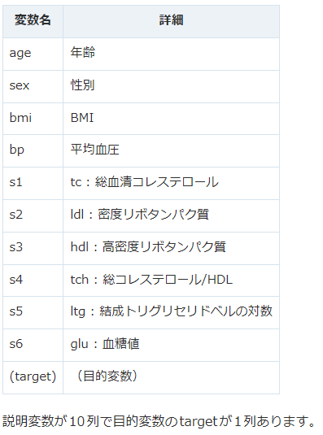
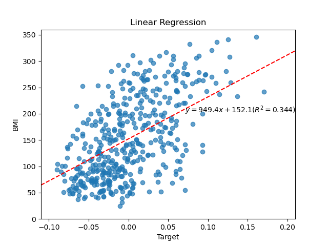
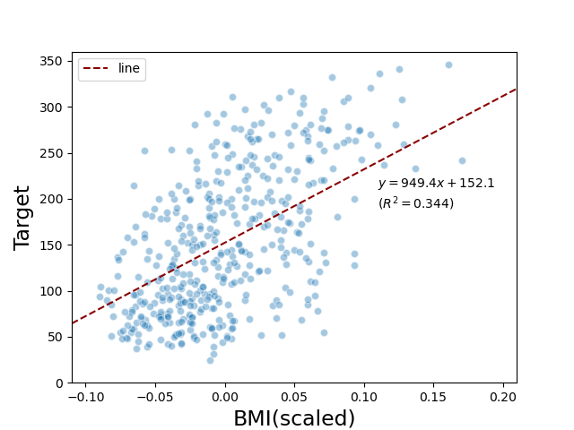

# Sentan-1-Miura

先端生命科学実験の三浦先生回分のプログラムフォルダ

## 環境構築メモ

python のバージョン: 3.10.9
Anacondaとvenvは併用できないぽいのでなーし！！

```
conda create -n tf_env python=3.10 // 仮想環境(tf_env)の作成
conda activate tf_env // 仮想環境の有効化←Anaconda promptでやった方が良いかも
conda env list // 環境一覧(*ついてるのが現在地)

code // Anaconda promptからVSCodeに移動

conda list // condaに入ってるものリスト
conda list [パッケージ] // パッケージの情報取得(なかったらwarning)

conda install -c conda-forge tensorflow
```

## 内容関連－1日目

データについて(from https://qiita.com/kotaroito/items/9e02e7378fc0053c01c0)

> 糖尿病患者442名のデータが入っており、基礎項目（age, sex, body mass index, average blood pressure）と6つの血液検査項目を入力とし、1年後の進行状況を予測ターゲットにします。








## 内容関連-2日目

```
Epoch 1/3
59/59 ━━━━━━━━━━━━━━━━━━━━ 1s 5ms/step - accuracy: 0.8292 - loss: 0.6771 
Epoch 2/3
59/59 ━━━━━━━━━━━━━━━━━━━━ 0s 5ms/step - accuracy: 0.9135 - loss: 0.3105 
Epoch 3/3
59/59 ━━━━━━━━━━━━━━━━━━━━ 0s 5ms/step - accuracy: 0.9323 - loss: 0.2442 
313/313 ━━━━━━━━━━━━━━━━━━━━ 1s 2ms/step - accuracy: 0.9406 - loss: 0.2155 
```
